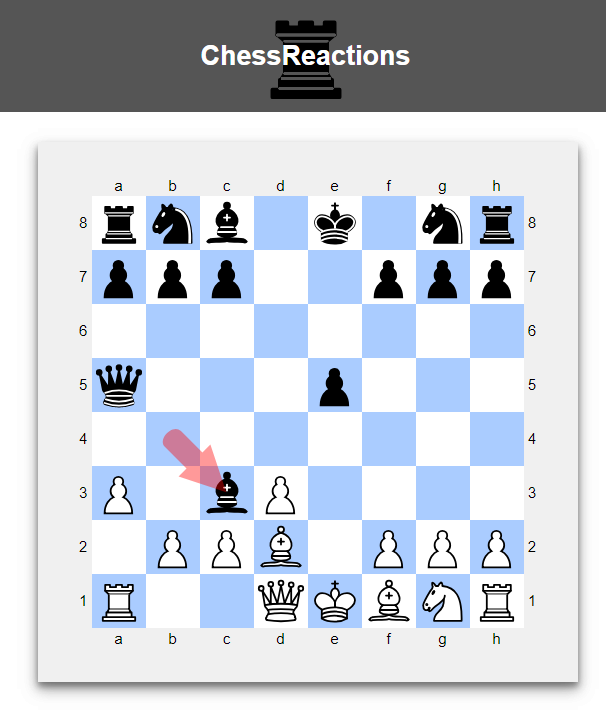

A small project to learn React by creating a chess application. I would like to add simple features such as importing groups of games (PGNs) for some data analysis that would be done on the web server using python libraries. The idea would be to learn openings based on a group of games by simulating random moves from an opponent for the best outcome. This is partly inspired by using chessable to study openings for the first time, and wanting to do some analysis on my own.

